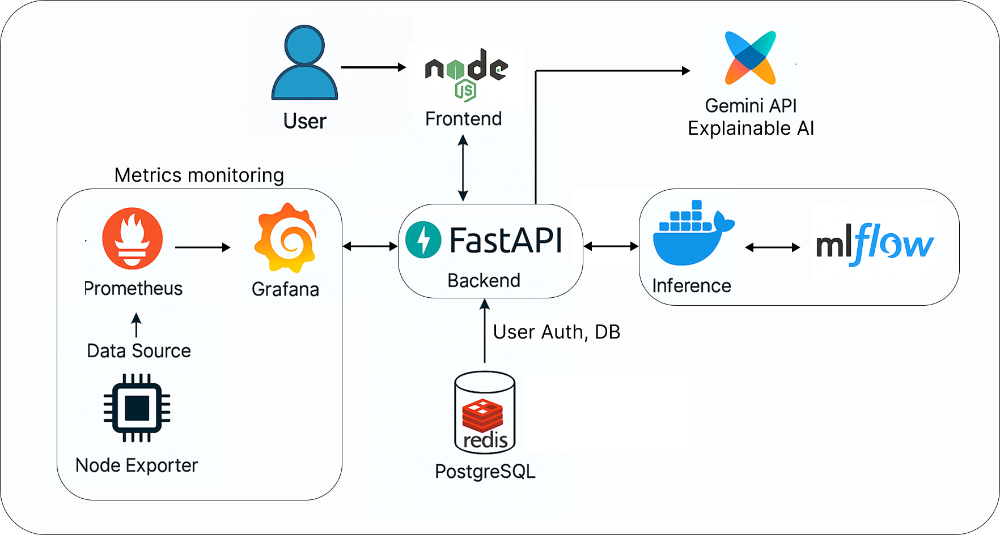

# ⚡️ Credit‑Card Fraud Lens — MLOps Project

Welcome to **Fraud Lens**, an end‑to‑end MLOps showcase that combines a production‑grade AI web application with an Airflow‑driven development pipeline.

* **AI Application** – real‑time fraud prediction, explainable AI (Gemini 2.0 Flash), and live Grafana based metrics monitoring panels.
* **Development Pipeline** – an Airflow DAG that continuously scans new data, checks for drift (Evidently), retrains a LightGBM model, registers it to MLflow, and can optionally build & push a Docker image.

> 📁 Everything lives under one repo so you can spin up the full stack with two Docker Compose commands.

---

## 🌳 Repository Layout

```text
cc_fraud_detection_app/                 # ← root
├─ airflow/                              # Airflow images & config
│  ├─ dags/                              #   └─ drift_retrain_dag.py …
│  └─ Dockerfile                         #   custom Airflow image
│  
├─ assets/                              # Diagrams & screenshots for docs/README
│  ├─ architecture.png
│  └─ pipeline.png
│  
├─ docs/                                # Formal docs (LaTeX → PDF)
│  ├─ App_Design.pdf
│  ├─ Dev_Pipeline_Design.pdf
│  └─ App_User_Manual.pdf
│  
├─ fraud_detection_app/                 # Docker‑compose stack (FastAPI, React…)
│  ├─ frontend/                         # React + Tailwind SPA
│  ├─ backend/                          # FastAPI, auth, OTP, Gemini, Prom
│  ├─ db/                               # Postgres initialisation
│  ├─ grafana/                          # Provisioned dashboards
│  ├─ prometheus/                       # Prom scrape config
│  ├─ .env                              # App‑level secrets (see .env.example)
│  └─ docker-compose.yml                # Stand‑alone app stack
│  
├─ mlflow/                              # Training + model packaging
│  ├─ train.py                          # LightGBM trainer w/ Evidently drift
│  └─ build.sh                          # Build & push model‑server image
│  
├─ monitoring/                          # Global Prometheus for pipeline nodes
│  └─ prometheus.yml
│  
├─ scripts/
│  └─ exploratory_data_analysis.ipynb   # Quick EDA notebook
│  
├─ .env                                 # Root‑level secrets (Airflow, MLflow)
└─ dvc.yaml                             # Data & experiment versioning
```

---

## 🚀 Quick Start

### 1 · Spin up the **development pipeline** (Airflow + MLflow)

```bash
# From repo root
cp .env.example .env            # edit secrets if needed
cd airflow
# build custom Airflow image once
docker compose build
cd ..

# launch all pipeline services + monitoring stack
docker compose up -d --build
```

* Open Airflow at <http://localhost:8080> (default creds: `airflow / airflow`).
* Trigger the **`drift_retrain`** DAG.
  * **detect_new_data ⟶ drift_check ⟶ (merge_datasets?) ⟶ featurize ⟶ train ⟶ register_model ⟶ push_metrics**
* If drift ≈ `True`, a new LightGBM model is trained and registered under `models:/fraud_model/<staging|production>`.
* **Optional** — build & push the new inference image:

  ```bash
  ./mlflow/build.sh  # tags & pushes e.g. sujays2001/fraud-detection-model:prod-v2
  ```

Monitoring ► Grafana <http://localhost:3001>  |  Prometheus <http://localhost:9090>

---

### 2 · Run the **Fraud Lens** web app

```bash
cd fraud_detection_app
cp .env.example .env           # configure SMTP, JWT secret, Gemini key …
docker compose up -d --build   # builds frontend, backend & pulls model image
```

* Visit the app at <http://localhost:3002>.
* Follow the **User Manual** in `docs/App_User_Manual.pdf` for a walk‑through.

### 3 · Shut down

```bash
# From the folder you ran compose in
docker compose down -v   # remove containers + named volumes
```

---

## 🛠️ Local Development Tips

| Task                                        | Command / File                                    |
|---------------------------------------------|-----------------------------------------------------|
| Rebuild frontend instantly (hot‑reload)     | `cd fraud_detection_app/frontend && npm run dev`   |
| Unit‑test backend (FastAPI + Pytest)        | `pytest fraud_detection_app/backend/tests`         |
| MLflow UI (model registry & runs)           | <http://localhost:5001>                            |
| Jupyter on training container               | `docker exec -it mlflow-train bash` → `jupyter`    |
| Format code (black, isort, eslint)          | `pre-commit run --all-files`                       |
| Data versioning via DVC                     | `dvc repro`  / `dvc metrics diff`                  |

---
## 📖 Further Reading

* **docs/App_Design.pdf** – high‑level + low‑level design of the web app.
* **docs/Dev_Pipeline_Design.pdf** – detailed Airflow DAG docs & drift logic.
* **assets/** – all source diagrams used in README and PDFs (.drawio).

Enjoy exploring Fraud Lens – and feel free to open issues or PRs! ✨
